# Database Architecture — MyFundingTrade

> Auto-generated reference for the production Prisma schema.

---

## Entity-Relationship Diagram (Mermaid)

```mermaid
erDiagram

    %% ── USER & IDENTITY ──────────────────────────────────────────
    User ||--o| UserProfile : has
    User ||--o{ Session : has
    User ||--o{ RefreshToken : has
    User ||--o{ Order : places
    User ||--o{ TraderAccount : owns
    User ||--o{ KycSubmission : submits
    User ||--o{ PayoutRequest : requests
    User ||--o{ PayoutMethod : registers
    User ||--o| AffiliateAccount : "may have"
    User ||--o{ SupportTicket : creates
    User ||--o{ SupportMessage : sends
    User ||--o{ Notification : receives
    User ||--o{ LegalConsent : accepts
    User ||--o{ AdminActionLog : performs
    User ||--o{ BlogPost : authors

    User {
        uuid id PK
        varchar email UK
        varchar password_hash
        enum role "TRADER | AFFILIATE | SUPPORT_AGENT | KYC_REVIEWER | FINANCE_ADMIN | CONTENT_ADMIN | SUPER_ADMIN"
        enum status "ACTIVE | INACTIVE | SUSPENDED | BANNED"
        boolean email_verified
        boolean two_factor_enabled
        timestamp last_login_at
        timestamp deleted_at
    }

    UserProfile {
        uuid id PK
        uuid user_id FK,UK
        varchar first_name
        varchar last_name
        varchar country "ISO 3166-1 alpha-2"
        varchar referral_code UK
        uuid referred_by_id
    }

    Session {
        uuid id PK
        uuid user_id FK
        varchar ip_address
        varchar user_agent
        timestamp expires_at
        timestamp revoked_at
    }

    RefreshToken {
        uuid id PK
        uuid user_id FK
        varchar token_hash UK
        varchar family "rotation detection"
        timestamp expires_at
        timestamp revoked_at
        uuid replaced_by
    }

    %% ── CHALLENGE PLANS & RULES ─────────────────────────────────
    ChallengePlan ||--o{ ChallengeVariant : "has sizes"
    ChallengeRuleSet ||--o{ ChallengeVariant : "governs"

    ChallengePlan {
        uuid id PK
        varchar name
        varchar slug UK
        text description
        boolean is_active
        int sort_order
    }

    ChallengeVariant {
        uuid id PK
        uuid plan_id FK
        uuid rule_set_id FK
        int account_size
        decimal price
        int leverage
        decimal profit_split
        int phases
        boolean is_active
    }

    ChallengeRuleSet {
        uuid id PK
        varchar name
        decimal profit_target_pct
        decimal max_daily_loss_pct
        decimal max_total_loss_pct
        int min_trading_days
        int max_calendar_days
        boolean allow_weekend_holding
        boolean allow_news_trading
        boolean allow_expert_advisors
    }

    %% ── COMMERCE ─────────────────────────────────────────────────
    Order ||--o{ Payment : "paid via"
    Order ||--o| TraderAccount : "provisions"
    Order }o--o| Coupon : "uses"
    Order ||--o| AffiliateConversion : "attributed to"

    Order {
        uuid id PK
        uuid user_id FK
        uuid variant_id FK
        uuid coupon_id FK
        varchar order_number UK
        enum status "DRAFT | PENDING_PAYMENT | PAID | FULFILLED | ..."
        decimal subtotal
        decimal discount_amount
        decimal total_amount
        timestamp paid_at
    }

    Payment {
        uuid id PK
        uuid order_id FK
        enum provider "STRIPE | CRYPTO | BANK_TRANSFER | MANUAL"
        enum status "PENDING | SUCCEEDED | FAILED | REFUNDED | ..."
        decimal amount
        varchar provider_payment_id
        timestamp paid_at
    }

    Coupon {
        uuid id PK
        varchar code UK
        enum type "PERCENTAGE | FIXED_AMOUNT"
        decimal value
        int max_usage_count
        int usage_count
        timestamp valid_from
        timestamp valid_until
    }

    %% ── TRADER ACCOUNTS & EVALUATION ────────────────────────────
    TraderAccount ||--o{ TraderAccountPhase : "goes through"
    TraderAccount ||--o{ PayoutRequest : "earns"
    TraderAccountPhase ||--o| AccountEvaluationResult : "evaluated by"

    TraderAccount {
        uuid id PK
        uuid user_id FK
        uuid order_id FK,UK
        uuid variant_id FK
        varchar account_number UK
        varchar platform "MT5"
        enum status "PROVISIONING | ACTIVE | BREACHED | PASSED | FUNDED | ..."
        decimal starting_balance
        decimal current_balance
        decimal current_equity
        decimal high_water_mark
        enum current_phase "PHASE_1 | PHASE_2 | FUNDED"
        timestamp funded_at
    }

    TraderAccountPhase {
        uuid id PK
        uuid trader_account_id FK
        enum phase "PHASE_1 | PHASE_2 | FUNDED"
        enum status "PENDING | ACTIVE | PASSED | FAILED | ..."
        timestamp start_date
        timestamp end_date
        decimal starting_balance
        decimal ending_balance
        int total_trades
        int trading_days
        decimal profit_loss
    }

    AccountEvaluationResult {
        uuid id PK
        uuid phase_id FK,UK
        enum verdict "IN_PROGRESS | PASSED | FAILED_DAILY_LOSS | ..."
        boolean profit_target_met
        boolean daily_loss_breached
        boolean total_loss_breached
        boolean min_days_met
        jsonb rule_violations
        timestamp evaluated_at
    }

    %% ── KYC / COMPLIANCE ────────────────────────────────────────
    KycSubmission ||--o{ KycReview : "reviewed by"
    LegalDocument ||--o{ LegalConsent : "accepted as"

    KycSubmission {
        uuid id PK
        uuid user_id FK
        enum status "NOT_STARTED | UNDER_REVIEW | APPROVED | REJECTED | ..."
        enum document_type "PASSPORT | GOVERNMENT_ID | DRIVERS_LICENSE | ..."
        varchar document_front_url
        varchar full_name
        timestamp submitted_at
    }

    KycReview {
        uuid id PK
        uuid submission_id FK
        uuid reviewer_id
        enum decision
        text reason
    }

    LegalDocument {
        uuid id PK
        enum type "TERMS_OF_SERVICE | PRIVACY_POLICY | ..."
        varchar version
        varchar title
        text content
        timestamp effective_at
    }

    LegalConsent {
        uuid id PK
        uuid user_id FK
        uuid document_id FK
        varchar ip_address
        timestamp consented_at
    }

    GeoRestriction {
        uuid id PK
        varchar country_code UK
        varchar country_name
        enum type "BLOCKED | ALLOWED"
        boolean is_active
    }

    %% ── PAYOUTS ─────────────────────────────────────────────────
    PayoutMethod ||--o{ PayoutRequest : "paid via"

    PayoutMethod {
        uuid id PK
        uuid user_id FK
        enum type "BANK_WIRE | CRYPTO_WALLET | PAYPAL | WISE | RISE"
        jsonb details
        boolean is_default
        boolean is_verified
    }

    PayoutRequest {
        uuid id PK
        uuid user_id FK
        uuid trader_account_id FK
        uuid payout_method_id FK
        varchar request_number UK
        decimal amount
        decimal profit_split
        decimal trader_share
        decimal company_share
        enum status "DRAFT | PENDING_APPROVAL | COMPLETED | REJECTED | ..."
    }

    %% ── AFFILIATE SYSTEM ────────────────────────────────────────
    AffiliateAccount ||--o{ AffiliateClick : tracks
    AffiliateAccount ||--o{ AffiliateConversion : earns
    AffiliateAccount ||--o{ CommissionPayout : "paid out"

    AffiliateAccount {
        uuid id PK
        uuid user_id FK,UK
        varchar affiliate_code UK
        enum status "PENDING | ACTIVE | SUSPENDED | TERMINATED"
        decimal commission_rate
        int tier
        decimal total_earnings
        decimal pending_balance
    }

    AffiliateClick {
        uuid id PK
        uuid affiliate_id FK
        varchar ip_address
        varchar referrer_url
        varchar utm_source
    }

    AffiliateConversion {
        uuid id PK
        uuid affiliate_id FK
        uuid order_id FK,UK
        enum status "PENDING | CONFIRMED | REJECTED | PAID"
        decimal order_amount
        decimal commission_amount
    }

    CommissionPayout {
        uuid id PK
        uuid affiliate_id FK
        decimal amount
        enum status "PENDING | APPROVED | COMPLETED | REJECTED"
        varchar transaction_ref
    }

    %% ── SUPPORT ─────────────────────────────────────────────────
    SupportTicket ||--o{ SupportMessage : contains

    SupportTicket {
        uuid id PK
        uuid user_id FK
        uuid assignee_id FK
        varchar ticket_number UK
        varchar subject
        enum category "ACCOUNT | BILLING | TRADING | KYC | PAYOUT | ..."
        enum priority "LOW | MEDIUM | HIGH | URGENT"
        enum status "OPEN | IN_PROGRESS | RESOLVED | CLOSED | ..."
    }

    SupportMessage {
        uuid id PK
        uuid ticket_id FK
        uuid sender_id FK
        text body
        boolean is_internal
        jsonb attachments
    }

    %% ── CONTENT ─────────────────────────────────────────────────
    BlogCategory ||--o{ BlogPost : contains

    BlogCategory {
        uuid id PK
        varchar name
        varchar slug UK
    }

    BlogPost {
        uuid id PK
        uuid author_id FK
        uuid category_id FK
        varchar title
        varchar slug UK
        enum status "DRAFT | SCHEDULED | PUBLISHED | ARCHIVED"
        timestamp published_at
    }

    FAQItem {
        uuid id PK
        varchar question
        text answer
        varchar category
        boolean is_published
    }

    NewsletterSubscriber {
        uuid id PK
        varchar email UK
        boolean is_confirmed
    }

    %% ── SYSTEM & AUDIT ─────────────────────────────────────────
    Notification {
        uuid id PK
        uuid user_id FK
        enum type "EMAIL | IN_APP | SMS | PUSH"
        enum status "QUEUED | SENT | DELIVERED | FAILED | READ"
        varchar title
        text body
    }

    AdminActionLog {
        uuid id PK
        uuid performer_id FK
        uuid target_user_id FK
        enum action "CREATE | UPDATE | DELETE | APPROVE | ..."
        varchar resource
        uuid resource_id
        jsonb before
        jsonb after
    }

    SystemSetting {
        uuid id PK
        varchar key UK
        text value
        varchar data_type
        boolean is_public
    }

    PlatformRestriction {
        uuid id PK
        varchar key UK
        boolean is_enabled
        varchar description
    }
```

---

## Table Summary

| # | Model | Table Name | Description |
|---|-------|-----------|-------------|
| 1 | `User` | `users` | Core identity & auth credentials |
| 2 | `UserProfile` | `user_profiles` | Extended profile: name, address, referral |
| 3 | `Session` | `sessions` | Server-side session tracking |
| 4 | `RefreshToken` | `refresh_tokens` | JWT refresh token rotation & revocation |
| 5 | `ChallengePlan` | `challenge_plans` | Product line (Standard, Aggressive, Rapid) |
| 6 | `ChallengeVariant` | `challenge_variants` | Plan × account size SKU ($10K–$200K) |
| 7 | `ChallengeRuleSet` | `challenge_rule_sets` | Evaluation rules per variant |
| 8 | `Order` | `orders` | Purchase intent with pricing & coupon |
| 9 | `Payment` | `payments` | Individual payment transaction |
| 10 | `Coupon` | `coupons` | Discount codes (% or fixed) |
| 11 | `TraderAccount` | `trader_accounts` | Provisioned MT5 trading account |
| 12 | `TraderAccountPhase` | `trader_account_phases` | Per-phase metrics & progress |
| 13 | `AccountEvaluationResult` | `account_evaluation_results` | Machine eval verdict per phase |
| 14 | `KycSubmission` | `kyc_submissions` | KYC document bundle |
| 15 | `KycReview` | `kyc_reviews` | Admin review actions on KYC |
| 16 | `LegalDocument` | `legal_documents` | Versioned legal/compliance docs |
| 17 | `LegalConsent` | `legal_consents` | User acceptance records |
| 18 | `GeoRestriction` | `geo_restrictions` | Country-level access rules |
| 19 | `PlatformRestriction` | `platform_restrictions` | Feature toggles |
| 20 | `PayoutMethod` | `payout_methods` | Trader payout destinations |
| 21 | `PayoutRequest` | `payout_requests` | Funded trader payout requests |
| 22 | `AffiliateAccount` | `affiliate_accounts` | Affiliate partner accounts |
| 23 | `AffiliateClick` | `affiliate_clicks` | Link click tracking |
| 24 | `AffiliateConversion` | `affiliate_conversions` | Order attribution to affiliates |
| 25 | `CommissionPayout` | `commission_payouts` | Batch commission payments |
| 26 | `SupportTicket` | `support_tickets` | Customer support tickets |
| 27 | `SupportMessage` | `support_messages` | Ticket thread messages |
| 28 | `BlogCategory` | `blog_categories` | Blog taxonomy |
| 29 | `BlogPost` | `blog_posts` | Blog articles with SEO |
| 30 | `FAQItem` | `faq_items` | Frequently asked questions |
| 31 | `NewsletterSubscriber` | `newsletter_subscribers` | Email list subscribers |
| 32 | `Notification` | `notifications` | Multi-channel notification queue |
| 33 | `AdminActionLog` | `admin_action_logs` | Immutable audit trail |
| 34 | `SystemSetting` | `system_settings` | Runtime key-value config |
| 35 | `PlatformRestriction` | `platform_restrictions` | Feature flags & kill switches |

---

## Domain Boundaries

### 1. Identity & Access (IAM)
`User` → `UserProfile` → `Session` → `RefreshToken`

Handles registration, authentication (JWT + 2FA), session management, and role-based access control for 7 distinct roles.

### 2. Product Catalog
`ChallengePlan` → `ChallengeVariant` → `ChallengeRuleSet`

Three-tier product model: plans are product lines, variants are purchasable SKUs (plan × size), rule sets define evaluation parameters per phase.

### 3. Commerce
`Order` → `Payment` → `Coupon`

Full order lifecycle with multi-provider payment support (Stripe, crypto, wire), discount codes, tax handling, and affiliate attribution.

### 4. Trading Evaluation
`TraderAccount` → `TraderAccountPhase` → `AccountEvaluationResult`

Accounts progress through phases (Phase 1 → Phase 2 → Funded). Each phase tracks granular metrics. Machine-generated evaluations determine pass/fail.

### 5. Compliance & KYC
`KycSubmission` → `KycReview` → `LegalDocument` → `LegalConsent` → `GeoRestriction`

Document verification workflow, legal consent tracking (immutable), and geographic access control for regulatory compliance.

### 6. Payouts
`PayoutMethod` → `PayoutRequest`

Multi-method payout system (wire, crypto, PayPal, Wise) with profit-split calculation and multi-step approval workflow.

### 7. Affiliate Program
`AffiliateAccount` → `AffiliateClick` → `AffiliateConversion` → `CommissionPayout`

Full affiliate lifecycle: click tracking with UTM, conversion attribution, tiered commissions, and batch payout processing.

### 8. Support
`SupportTicket` → `SupportMessage`

Ticket-based support with categories, priorities, assignment, internal notes, and file attachments.

### 9. Content
`BlogCategory` → `BlogPost` → `FAQItem` → `NewsletterSubscriber`

CMS for SEO-optimized blog, FAQ management, and newsletter subscriptions.

### 10. System & Audit
`Notification` → `AdminActionLog` → `SystemSetting` → `PlatformRestriction`

Multi-channel notification queue, immutable admin audit trail with before/after snapshots, runtime configuration, and feature toggles.

---

## Key Design Decisions

| Decision | Rationale |
|----------|-----------|
| **UUID v4 primary keys** | No sequential ID leakage, safe for public APIs |
| **`@@map` snake_case tables** | PostgreSQL convention, camelCase in TypeScript |
| **Soft deletes** (`deletedAt`) | Audit trail, data recovery, GDPR compliance |
| **Decimal for money** | Avoids floating-point precision issues |
| **JsonB for flexible data** | Payment metadata, payout details, rule violations |
| **Composite indexes** | Optimized for common query patterns (status + date, user + read) |
| **Immutable audit logs** | No `updatedAt` on `AdminActionLog` — write-once |
| **Token family tracking** | Refresh token rotation detection for security |
| **Separate Profile model** | Auth data stays lean; profile loaded on demand |
